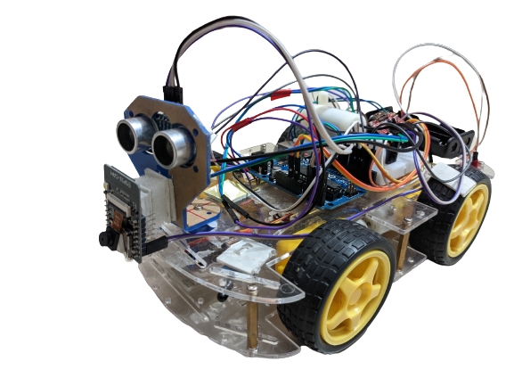

# FireRescue-X

## AI-Assisted Firefighting and Rescue Robot

FireRescue-X is a physical firefighting and rescue robot developed to
assist in hazardous environments by combining autonomous obstacle
avoidance, flame detection, fire suppression, manual wireless control,
and camera-based monitoring.



## Overview

The robot was developed as a multifunctional firefighting and rescue
platform. The prototype combines Arduino-based low-level control,
multiple flame sensors, ultrasonic obstacle detection, motor control,
a water pump, Bluetooth communication, and an ESP32-CAM for live
visual monitoring.

The original system was designed several years ago. The project is
now being prepared for modernization using lightweight real-time
computer vision models running on a local machine.

## Key Features

- Autonomous obstacle avoidance
- Fire/flame detection
- Fire suppression using a water pump
- Manual Bluetooth control
- ESP32-CAM live video monitoring
- Human detection through computer vision
- Real physical robotic prototype
- Local-machine image processing architecture

## Operating Modes

### Automatic Mode

The robot uses its sensors to detect fire and obstacles and performs
navigation and firefighting actions.

### Manual Mode

The robot can be controlled wirelessly using commands from a mobile
device through the Bluetooth module.

## Hardware

- Arduino UNO R3
- ESP32-CAM
- HC-06 Bluetooth module
- L298N motor driver
- DC motors
- Ultrasonic sensor
- Flame sensors
- Servo motor
- Water pump
- Robot chassis

## System Architecture

```text
                    FireRescue-X
                         │
              ┌──────────┴──────────┐
              │                     │
        Robot Control          Vision System
              │                     │
        Arduino UNO            ESP32-CAM
              │                     │
     ┌────────┼────────┐           │
     │        │        │           │
  Sensors   Motors    Pump         │
                                  │
                                  ▼
                            Local Machine
                                  │
                         Real-Time Processing
                                  │
                       ┌──────────┴─────────┐
                       │                    │
                  Fire Detection      Human Detection