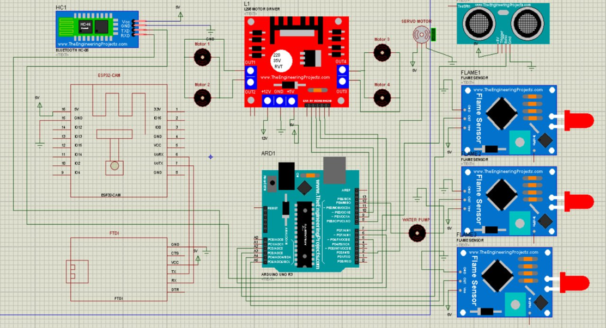
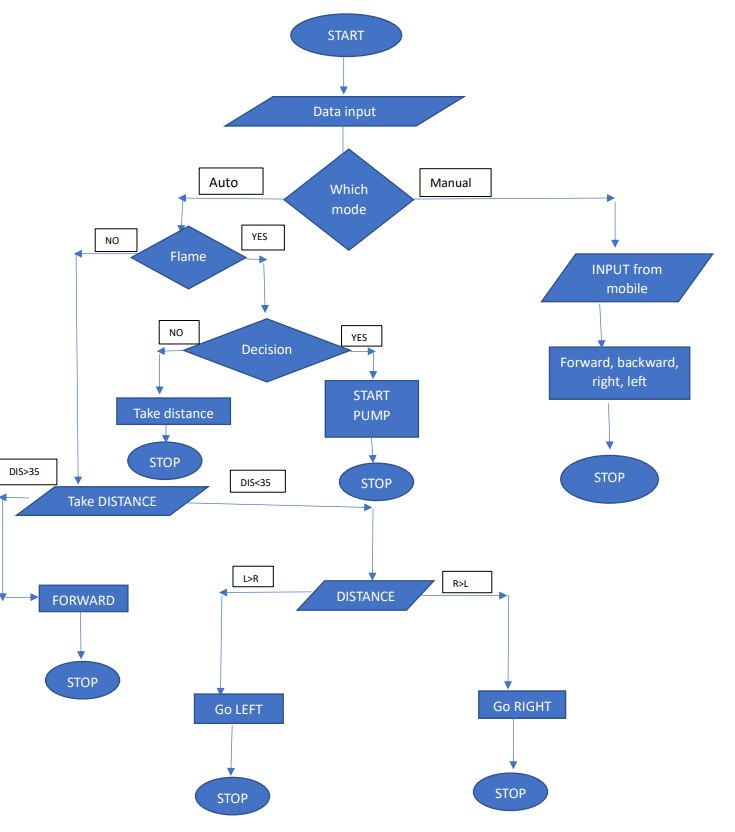

# 🏗️ System Architecture

The Firefighting and Rescue Robot consists of an Arduino-based
embedded control system, sensing and actuation components, and an
ESP32-CAM-based visual monitoring system.

<p align="center">
  
</p>

<p align="center">
  <b>Figure 1 — System architecture of the firefighting and rescue robot.</b>
</p>

The Arduino UNO handles the main robotic operations, including sensor
readings, motor control, obstacle avoidance, flame detection, servo
control, water-pump activation, and wireless commands.

The ESP32-CAM provides the live visual feed. The visual-processing
pipeline is handled separately on a developer/local machine, allowing
the developer to use modern lightweight computer-vision models without
requiring a complete redesign of the robot hardware.

---

# 🔄 System Flowchart

The following flowchart represents the overall operating process of
the robot, including automatic firefighting, obstacle avoidance, and
manual control.

<p align="center">
  
</p>

<p align="center">
  <b>Figure 2 — Operational flowchart of the firefighting and rescue robot.</b>
</p>

---

# 📷 Visual Processing

The ESP32-CAM is responsible for capturing and providing the live
camera feed. **Image processing is performed on the developer's local
machine rather than being restricted to the ESP32-CAM.**

This is particularly important because the original project was
developed several years ago. Modern lightweight computer-vision models
can now provide significantly more capable real-time processing on
ordinary local computers.

Therefore, developers can use their preferred modern lightweight model
for the live camera stream.

```text
              ESP32-CAM
                  │
                  │ Live Video Feed
                  ▼
          Developer's Local Machine
                  │
                  ▼
        Real-Time Image Processing
                  │
          ┌───────┴───────┐
          │               │
          ▼               ▼
    Fire Detection   Human Detection
                          │
                          ▼
                  Partial / Occluded
                  Human Detection